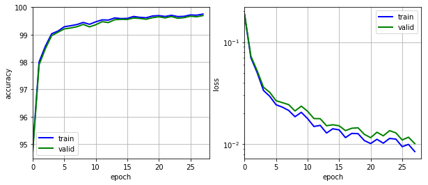

# Traffic Signs Recognition

Recognizing and classifying traffic sign images into 43 classes taken from [GTSRB](http://benchmark.ini.rub.de/?section=gtsrb&subsection=dataset) dataset.

The model is designed using Spatial Transformer Network with a modified version of IDSIA networks and trained with heavily augmented data. The models reaches about __99.5%__ test set accuracy on Kaggle Leaderboard which is quite above than human accuracy.


## Data

Download both train and test folders from [here](https://www.kaggle.com/c/nyu-cv-fall-2017/data)


## Running

Project can be run using `main.py` file.

Just make sure to run `pip install -r requirements.txt` before running anything

## Steps for running via python files

Follow the steps below to run the project from python files:

### Requirements

Download data as mentioned above and install requirements which mainly include `pytorch` and `torchvision`.

### Augment and Preprocess

Run `preprocess.py` with options as mentioned below:

```
usage: preprocess.py [-h] [--data D] [--save_loc P] [--intensity LR]
                     [--class_count LR]

Preprocess GTSRB data

optional arguments:
  -h, --help        show this help message and exit
  --data D          folder where data is train data is located
  --save_loc P      folder where all the pickles will be stored
  --intensity LR    Augmentation intesity (default: 0.75)
  --class_count LR  Each class will have this number of samples after extension
                    and balancing (Default: 10k)
```

Sample command:

```
python preprocess.py --data data/train_images --intensity 0.75 --save_loc . --class_count 20000
```

## Train

Use `main.py` file for training the model. There are various options present which you can check in the file itself. Most important is `--train_pickle` which specifies the training pickle to use. Here is a sample command:

```
python main.py --st --data data_test --locnet 200,300,200 --locnet3 150,150,150 --lr 0.0001  --epochs 30 --train_pickle train_balanced_preprocessed_0.75.p --save_loc . --resume early_stopping_checkpoint
```

`main.py` will output various information about the training process throughout the training.

Training curve:



## Evaluate

Use `evaluate.py` to generate a CSV which contains predicted labels for each of the images in test folder.

Sample command:

```
python evaluate.py --data data --resume early_stopping_checkpoint
```

The project was seeded using stater code from this [repo](https://github.com/soumith/traffic-sign-detection-homework)
